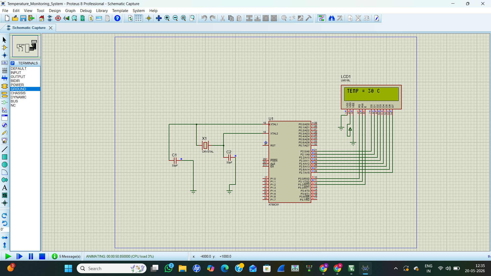

# 🌡 Temperature Monitoring System using 8051

## 📌 Project Overview
This project displays temperature values on a 16x2 LCD using the 8051 microcontroller.  
The project was developed using Keil µVision and simulated in Proteus.

## 🛠 Software Used
- Keil µVision
- Proteus 8 Professional

## 🔧 Components Used
- AT89C51 Microcontroller
- 16x2 LCD Display
- Crystal Oscillator
- Capacitors
- Power Supply

## 📷 Simulation Output

## 💻 Features
- LCD interfacing with 8051
- Embedded C programming
- Proteus simulation
- Temperature display system

## 📁 Files Included
- `main.c` → Embedded C source code
- `Temperature_Monitoring_System.hex` → HEX file for Proteus
- `temperature_monitor_output.png` → Simulation screenshot

## 👩‍💻 Developed By
Nithyasri
